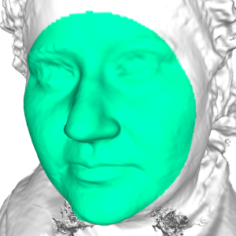
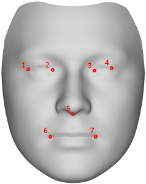

# IEEE FG 2018 Workshop on Dense 3D Reconstruction of 2D Face Images in the Wild - Special Session: Competition

This repository contains the evaluation scripts for the FG2018 3D face reconstruction challenge.

Website: https://facer2vm.org/fg2018/

# Installation

The script requires numpy and pymesh. We recommend to do the installation in a virtualenv. The installation is tested with python3.6, but may work with other versions.

1) Create virtualenv: `mkvirtualenv fg2018`. Make sure you're inside the virtualenv - your command prompt should show something like `(fg2018) [user@computer ~]$`.
2) Install numpy: `pip install numpy`
3) Install PyMesh. Unfortunately PyMesh is not on pip (there is a "pymesh" package on pip, but it is a different pymesh!).
We recommend to follow the PyMesh installation manual: http://pymesh.readthedocs.io/en/latest/installation.html and after cloning and setting `PYMESH_PATH`, do:
`./setup.py build` and `./setup.py install`. Do this from **inside** the virtualenv. It should compile, create a python package and install it into the virtualenv.
The script should now be able to import PyMesh via `import pymesh`.

# Evaluation

The task of the challenge is to reconstruct a face in 3D from a single 2D image input. The script provided here compares a reconstructed 3D mesh with a high-resolution 3D ground truth scan.
For more information regarding the data and submission deadlines, please see the workshop website https://facer2vm.org/fg2018/.

**Challenge rules**: One set of parameters has to be used for all images of all subjects. No fine-tuning is allowed on a per-image or per-subject basis.

**Evaluation area**:
The reconstructed 3D face shape will be compared with the ground truth 3D face shape, over an area consisting of the inner face. The area is depicted below for an example scan.

</img>

**Evaluation metric**:
The script performs the following steps to compute the 3DRMSE between a predicted 3D face shape and the 3D ground truth scan:
1) The predicted and ground truth meshes will be rigidly aligned (by translation, rotation, and scaling). Scaling is compensated for because participants resulting meshes might be in a different coordinate system, whereas the ground truth scans are in the unit of millimetres. The rigid alignment is based on 7 points: Both inner and outer eye corners, the nose-bottom, and the mouth corners. The ground truth is annotated with these 7 points, whereas participants are expected to specify the 3D coordinates for these 7 points on their resulting meshes.

</img>

2) For each vertex in the ground truth scan, the distance is computed to the closest point on the surface of the predicted mesh.
3) These distances, along with the corresponding vertex index of the ground truth scan, are saved to a text file and used to compute the 3DRMSE as well as more specific analysis by the organisers, e.g. the distribution of errors across different face regions.

## Submission format
The participants submit the resulting text files containing the computed mesh distances, along with a declaration that they have abided to the rules and protocol set out in this document (e.g. not having tuned the parameters for individual images). The files should be named having the same name as the ground truth scan, adding the text `_distances`, and with extension `.txt`, e.g. `F1008_A_distances.txt`.

# First run example

The file `run_example.py` provides an example of how to use the provided script. It loads a ground truth scan with its annotation, and shows how a predicted mesh can be loaded in the same way (e.g. from an `.obj` file).
In principle, participants results can be in any form, as long as they can be converted to a mesh, i.e. a list of vertices and a list of faces (triangles).

The script `compute_vertices_to_mesh_distances(groundtruth_vertices, grundtruth_landmark_points, predicted_mesh_vertices, predicted_mesh_faces, predicted_mesh_landmark_points, out_filename)` then aligns the meshes based on the given annotations and then computes the distance values.

After running the script, please verify the output `.txt` file contains a list of vertex indices alongside floating point distance values, like e.g. so:
```
1843 1.543212
1846 1.284938
2385 2.168093
[...]
```

# Issues & help

For any issues or help, please open a GitHub issue here.
